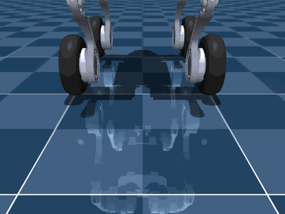

# Unitree Go2w 分层导航强化学习（MoRA-inspired）

> MuJoCo 轮腿机器人作品集：从"双轮自平衡"到"10m 两段导航"再到"岔路口决策"。
> 核心主线：用三层架构（System 2 决策 / System 1 导航 / System 0 控制）解决
> 单层 PPO 学不会的长程导航问题。

## English Abstract

This project builds a **hierarchical navigation agent** for the Unitree Go2w
wheel-legged robot in MuJoCo, inspired by the MoRA Agentic-Native architecture.
A low-level scripted controller (System 0) tracks the path centerline; a
high-level PPO policy (System 1) outputs 2-D navigation commands; and a rule
based System 2 makes branch decisions at junctions. Pure single-layer PPO/BC/DAgger
failed on the curve task (≤0.7 m), while the hierarchical agent reached **100%
success on a 10 m two-subgoal navigation task with precise stopping** and
**100% success on a junction decision task**, with 0 falls in formal evaluation.

## 核心亮点

- **三层控制架构**：System 0 前视点差速控制器 → System 1 高层 PPO（2 维动作）→
  System 2 规则决策（A→左 / B→右）。
- **动作空间降维**：6 维力矩 → `[speed_scale, turn_adjust]`，并禁止停车
  （`speed_scale≥0.9`），消除"站桩"局部最优。
- **BC 预热 + 三阶段课程**：脚本演示监督 actor → 段1/段2/完整任务逐级微调，
  norm 冻结 + 学习率 warmup 防止 negative transfer。
- **精确停止**：位置 ±0.15m + 停留 0.3s + 速度 <0.2m/s，A/B 子目标均达标。
- **工程闭环**：197 项单元测试、Pyright 0 errors、训练守护、实时 Web 面板、
  自动报告与演示视频。

## 实验结果（reports/ 实测数据）

| 任务 | 方法 | 成功率 | 关键指标 |
|---|---|---|---|
| 双轮自平衡 | LQR 型反馈 | — | 保持 10.5s，偏差 0.002 rad |
| 单段弯道（MoRA 分层） | System 0 + System 1 PPO | 100% | 1.355 m，0 摔倒 |
| 单段弯道 B+ | 随机目标 + 轻量 HER | 90% | 0.834 m |
| 单段弯道 B+ 无目标 | 消融对照组 | 100% | 1.352 m |
| **10m 两段导航 A→B** | 课程学习 + 精确停止 | **100%** | A 停止 100%，15.2 s，0 摔倒 |
| **岔路口 A→B 决策** | System 2 规则 + System 1 | **100%** | 分支正确 100%，7.0 s，0 摔倒 |

对照组：单层 PPO（v1~v5）、BC、DAgger、课程学习早期版本全部失败（≤0.7 m），
详见 [docs/EXPERIMENTS.md](docs/EXPERIMENTS.md)。

## 架构

```text
System 2 规则决策（岔路口锁定分支）
        │ target/branch 观测
System 1 高层 PPO（61+7 维观测 → [speed_scale, turn_adjust]）
        │ 2 维导航指令
System 0 前视点跟踪 + 差速转向（→ 6 维力矩）
        │
     MuJoCo Go2w 仿真
```

完整设计见 [docs/ARCHITECTURE.md](docs/ARCHITECTURE.md)。

## 演示




高清版见 `media/`（`*.mp4`）。

## 快速开始

```bash
# 1. 环境
conda create -n mujoco_env python=3.10
conda activate mujoco_env
pip install -r requirements.txt

# 2. 双轮自平衡演示（无显示环境加 MUJOCO_GL=egl）
python scripts/demo_go2w.py

# 3. 录制演示视频
bash scripts/make_demo.sh balance

# 4. 全量测试
python -m unittest discover -s tests -p 'test_*.py'
```

训练入口：

```bash
# 单任务 PPO（balance / traverse_curve 等）
python rl/train.py --task traverse_curve --seed 0 --total-steps 2000000

# 高层分层训练（单段/多段/岔路口课程学习）
python scripts/train_high_level_curve.py
python scripts/train_multi_segment_curriculum.py
python scripts/train_junction_curriculum.py

# 本地 Web 面板（训练进度 / 资源 / 报告）
python rl/webpanel.py --host 127.0.0.1 --port 8787
```

## 目录结构

```text
├── rl/                  # 环境、PPO 训练、低层控制器、评估、Web 面板
│   ├── go2w_env.py      # Gymnasium 环境（balance/traverse/多段/岔路口）
│   ├── low_level_controller.py   # System 0 脚本控制器
│   ├── high_level_env_wrapper.py # System 1 高层包装器（2 维动作）
│   └── train.py         # SB3 PPO 训练入口
├── scripts/             # 演示、BC 预热、课程学习、报告脚本
├── tests/               # 197 项单元测试
├── models/go2w/         # 宇树官方 Go2w 模型（BSD-3）
├── data/demo_trajectories/  # 演示轨迹、BC 模型、实验报告
├── reports/             # 各任务验收报告与指标
├── media/               # GIF / MP4 演示
└── docs/                # 架构、实验索引、第三方许可
```

## 实验演进（失败 → 根因 → 修复）

1. 单层 PPO / BC / DAgger：弯道全部 ≤0.7 m → 证明需要目标与进度概念。
2. 分层第一步：动作允许停车 → 学到站桩 0 m → 禁止停车后单段 100%。
3. 多段 A→B 首版：冲过 B 点不停车 → 停靠奖励、过冲惩罚、B 点到达即终止。
4. 岔路口：System 2 规则决策 + System 1 分支导航 → 40-episode 验收 100%。

## 许可证

- 本项目自身代码：MIT（见 [LICENSE](LICENSE)）。
- 宇树 Unitree Go2w 模型：BSD-3-Clause（`models/go2w/LICENSE`）。
- 高度场地形算法参考 westonrobot/unitree_mujoco（BSD-3），见
  [docs/THIRD_PARTY_NOTICES.md](docs/THIRD_PARTY_NOTICES.md)。
