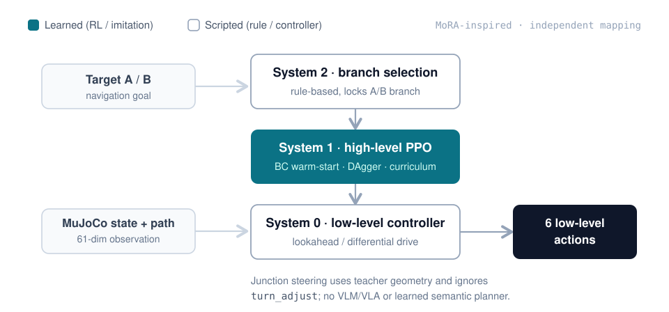

# Unitree Go2W 分层导航强化学习（MoRA-inspired）

在 MuJoCo 中为 Unitree Go2W 实现分层导航：把学习问题收敛为“高层 PPO 指令 + 脚本底层控制”，并评估弯道跟踪、多段停靠与岔路口选路。**仅仿真（simulation-only）。**

`PPO` `行为克隆 BC` `DAgger` `课程学习` `消融实验`

[](requirements.txt)
[](https://mujoco.org/)
[](LICENSE)

**技术栈：** Python · PyTorch · MuJoCo · Gymnasium · Stable-Baselines3

**阅读入口：** [了解架构](docs/ARCHITECTURE.md) · [查看实验](docs/EXPERIMENTS.md) · [运行项目](docs/USAGE.md) · [核验记录](docs/PORTFOLIO_VALIDATION.md)

## 代表演示

下面是已归档训练策略在 MuJoCo 中的仿真录像，可直接查看；快速开始生成的是脚本教师轨迹，不是这些 PPO 策略，也不包含任何实机录像。

| 弯道导航 | 两段导航 A→B | 岔路口导航 |
| --- | --- | --- |
|  |  |  |

[弯道 MP4](media/rl_traverse_curve_high_level_seed01.mp4) · [两段 MP4](media/rl_traverse_curve_multi_segment_seed00_v2.mp4) · [岔路口 MP4](media/rl_traverse_curve_junction_seed00.mp4)

## 关键结果

以下描述“规则 + 控制器 + 策略”的完整系统，**不能单独归因于 PPO**；同一批 episode 重复不等同于独立场景或独立训练种子。

| 任务 | 记录结果 | 证据 |
| --- | --- | --- |
| 单段弯道 | **20/20 成功**，平均距离 1.355 m，**0 摔倒** | [seed01 报告](reports/traverse_curve_high_level/seed01/report.md) |
| 两段导航 A→B | **20/20 成功**，A 点停止 100%，平均 15.2 s，**0 摔倒** | [v2 报告](reports/traverse_curve_multi_segment/seed00_v2/report.md) |
| 岔路口 A/B | **40/40 成功**，分支正确 100%，平均 7.0 s，**0 摔倒** | [岔路口报告](reports/traverse_curve_junction/seed00/report.md) |
| 质量检查（2026-09-12） | **196 通过 / 1 跳过**（共发现 197）；Pyright 0 错误 | [范围与环境](docs/PORTFOLIO_VALIDATION.md) |

首页成功 PPO 演示对应的最终权重与完整训练日志**不在当前快照中**，复现需要重新训练，证据边界见下文[已知限制](#已知限制)。

## 项目概述（为什么这样设计）

直接从 61 维观测学习 6 个底层动作时，记录的弯道实验中策略会原地不动或只能短距离移动。研究问题是：显式任务状态 + 更小的导航动作空间，是否能支撑更长、分阶段的任务。MoRA-inspired 指对分层思想的独立工程化映射，并非官方复现；System 2 当前采用规则决策。

## 系统架构



- **System 2：** 在岔路口决策区将 A 映射到左分支、B 映射到右分支并锁定。
- **System 1：** 动作接口为 `[speed_scale, turn_adjust]`；观测按任务追加目标或进度状态，PPO 由 BC 预热并经课程训练。
- **System 0：** 使用已知路径几何和仿真位置/航向进行跟踪；多段任务包含脚本制动与停止逻辑。

当前岔路口执行分支未使用 `turn_adjust`，策略实际只调节速度；系统未实现 VLM/VLA 或可学习语义规划。各层职责、观测与限制见[架构文档](docs/ARCHITECTURE.md)。

## 实验结果

以下为已有报告记录，并非每次重新训练的保证。距离列沿用报告指标，不代表统一的路径长度定义。

| 任务 | 评估规模 | 成功率 | 报告指标 | 报告 |
| --- | --- | --- | --- | --- |
| 单段弯道 seed01 | 20 回合 | 100% | 平均距离 1.355 m，0 摔倒 | [弯道](reports/traverse_curve_high_level/seed01/report.md) |
| 随机目标 B+ | 20 回合 | 90% | 平均距离 0.834 m，2 摔倒 | [B+](reports/traverse_curve_high_level_bplus/seed00/report.md) |
| 无目标输入消融 | 20 回合 | 100% | 平均距离 1.352 m | [no-goal](reports/traverse_curve_high_level_bplus_no_goal/seed00/report.md) |
| 两段导航 A→B | 20 回合 | 100% | A 点停止 100%，平均 15.2 s，0 摔倒 | [两段](reports/traverse_curve_multi_segment/seed00_v2/report.md) |
| 岔路口 A/B | 40 回合（各 20） | 100% | 分支正确 100%，平均 7.0 s，0 摔倒 | [岔路口](reports/traverse_curve_junction/seed00/report.md) |

课程进展图：[多段课程](docs/images/multi_segment_curriculum.png) · [岔路口课程](docs/images/junction_curriculum.png)；[弯道 BC 消融图](docs/images/curve_high_level_ablation.png)。失败实验、对照与证据差异见[实验文档](docs/EXPERIMENTS.md)。

## 快速开始

推荐在 Linux 或 WSL2 的 Linux 文件系统中运行，使用 Python 3.10 或 3.12。模型资产存在大小写同名文件，macOS 和原生 Windows 的常见文件系统可能无法完整检出；参见[系统要求](docs/USAGE.md#11-系统要求)。

```bash
git clone https://github.com/Anhao1314/go2w-MoRA-navigation.git
cd go2w-MoRA-navigation
python -m venv .venv
source .venv/bin/activate
pip install -r requirements.txt
```

验证环境，无需训练模型或显示窗口：

```bash
python - <<'PYTHON'
from rl.go2w_env import Go2wEnv
env = Go2wEnv(task="traverse_curve", domain_randomize=False)
obs, info = env.reset(seed=0)
print("observation:", obs.shape, "action:", env.action_space.shape)
env.close()
PYTHON
```

预期维度为 `(61,)` 和 `(6,)`。训练、模型评估、录像、检查命令与教师轨迹生成见[使用指南](docs/USAGE.md)。

## 仓库结构与文档导航

| 目录 | 内容 |
| --- | --- |
| [`rl/`](rl/) | 环境、分层控制、训练、评估与本地监控 |
| [`scripts/`](scripts/) | BC、DAgger、课程训练、教师轨迹和报告入口 |
| [`tests/`](tests/) | 环境、控制接口与工具链测试 |
| [`reports/`](reports/) | 精选验收报告与指标 |
| [`data/demo_trajectories/`](data/demo_trajectories/) | 教师轨迹、BC 模型、归一化参数与实验记录 |
| [`media/`](media/) | 归档 GIF / MP4 |
| [`models/go2w/`](models/go2w/) | Go2w 模型与许可 |

- [架构设计](docs/ARCHITECTURE.md)：层级职责、观测、动作与实现入口。
- [实验记录](docs/EXPERIMENTS.md)：结果、对照、失败与待验证问题。
- [使用指南](docs/USAGE.md)：安装、演示、训练、评估、检查与常见问题。
- [第三方声明](docs/THIRD_PARTY_NOTICES.md)：来源与许可说明。

## 质量检查

```bash
python -m unittest discover -s tests -p 'test_*.py'
pyright rl scripts mujoco_demos
```

[CI](.github/workflows/ci.yml) 会在 Linux 上安装依赖、运行测试并检查上述源码目录；工作流文件本身不等于 CI 已通过，请以实际 Actions 运行为准。当前计数属于对应一次实际运行，并非永久徽章。

## 已知限制

- 当前使用仿真状态与已知路径，没有验证真实传感、实机控制或开放场景泛化。
- 分支选择与部分停靠行为由脚本完成；结果描述整个系统，不能直接归因于 PPO。
- 评估场景与样本有限，100% 仅表示对应批次全部成功；未做独立留出场景/多种子验证。
- `rl/runs/` 未提交；成功 PPO 演示对应的最终权重与归一化文件不在当前快照中，需按指南训练生成，已提交 BC 模型不等同于最终 PPO 模型。

## 贡献者

- **Anhao1314** — 项目负责人；原始系统、实验、机器人/RL 实现与归档证据。
- **ChatGPT（OpenAI）** — AI 协作贡献：仓库审计、[实验完整性重构](https://github.com/Anhao1314/go2w-MoRA-navigation/pull/1)、可复现评估/测试设计与文档改进。该署名不对应独立 GitHub 账号，也不表示独立作者身份。

## 许可证

自研代码采用 [MIT License](LICENSE)。Go2w 模型许可见 [models/go2w/LICENSE](models/go2w/LICENSE)，其他来源见[第三方声明](docs/THIRD_PARTY_NOTICES.md)。
