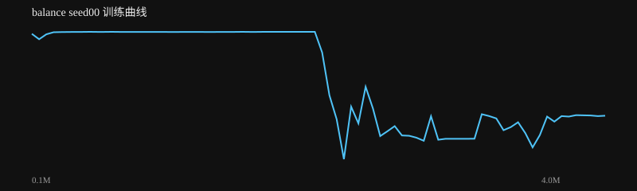

# balance seed00 训练报告

生成时间：2026-08-18 20:57:10

**结论：✅ 通过**

## 验收检查

- ✅ 最大俯仰偏差: 0.013781471915627938 ≤ 0.1
- ✅ 最小前轮离地: 0.4339423368475094 ≥ 0.1

## 指标

| 指标 | 值 |
|---|---|
| label | RL PPO |
| task | balance |
| max_dev | 0.013781471915627938 |
| min_clear | 0.4339423368475094 |
| dual_hold | 10.0 |
| recovered | False |
| settle_seconds |  |
| success | True |
| success_rate | 1.0 |
| distance |  |
| time_to_goal |  |
| falls | 0.0 |
| total_reward | 99.94285289963054 |
| mean_base_reward | 0.9999428528996305 |
| nan | False |

## 训练曲线

