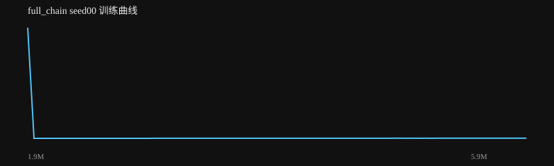

# full_chain seed00 训练报告

生成时间：2026-08-18 20:57:39

**结论：❌ 未通过**

## 验收检查

- ❌ 四轮恢复成功: False
- ❌ 恢复后稳定时长: 0.0 ≥ 2.0s
- ❌ 双轮保持: 0.372 ≥ 5.0s

## 指标

| 指标 | 值 |
|---|---|
| label | RL PPO |
| task | full_chain |
| max_dev | 0.40034876849592105 |
| min_clear | -0.00027650201141399267 |
| dual_hold | 0.372 |
| recovered | False |
| settle_seconds | 0.0 |
| success | False |
| success_rate | 0.0 |
| distance |  |
| time_to_goal |  |
| falls | 0.0 |
| total_reward | 114.23449868452079 |
| mean_base_reward | 0.8864837091358663 |
| nan | False |

## 训练曲线

