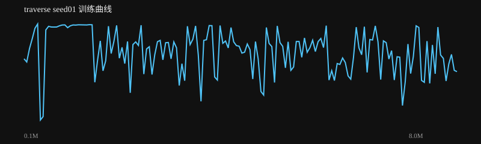
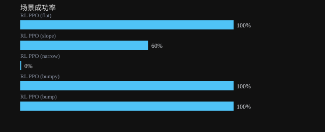

# traverse seed01 训练报告

生成时间：2026-08-17 09:22:24

**结论：❌ 未通过**

## 验收检查

- ❌ 整体成功率: 72% ≥ 80%
- ✅ 场景成功率 RL PPO (flat): 100% ≥ 60%
- ✅ 场景成功率 RL PPO (slope): 60% ≥ 60%
- ❌ 场景成功率 RL PPO (narrow): 0% ≥ 60%
- ✅ 场景成功率 RL PPO (bumpy): 100% ≥ 60%
- ✅ 场景成功率 RL PPO (bump): 100% ≥ 60%

## 指标

| 指标 | 值 |
|---|---|
| label | RL PPO (flat) / RL PPO (slope) / RL PPO (narrow) / RL PPO (bumpy) / RL PPO (bump) |
| task | traverse / traverse / traverse / traverse / traverse |
| max_dev | 0.09230251310235177 / 0.40039048606722133 / 0.03149968571793036 / 0.08894451340414994 / 0.08261274186584275 |
| min_clear |  /  /  /  /  |
| dual_hold | 0.0 / 0.0 / 0.0 / 0.0 / 0.0 |
| recovered | False / False / False / False / False |
| settle_seconds |  /  /  /  /  |
| success | True / False / False / True / True |
| success_rate | 1.0 / 0.6 / 0.0 / 1.0 / 1.0 |
| distance | 4.528723695336572 / 3.1423134227341407 / 0.49665304735422583 / 4.541749114180869 / 4.533489724400335 |
| time_to_goal | 4.897999999999689 / 7.309999999999569 /  / 5.3859999999997115 / 5.129999999999699 |
| falls | 0.0 / 0.4 / 1.0 / 0.0 / 0.0 |
| total_reward | 137.8925110057259 / 67.49431513684169 / 18.44334613734626 / 137.5595548525621 / 137.611612259356 |
| mean_base_reward | 0.9651497126964722 / 0.9161903008010933 / 0.983967593690742 / 0.9631832263795352 / 0.9618171108212007 |
| nan | False / False / False / False / False |

## 训练曲线

## 场景成功率

