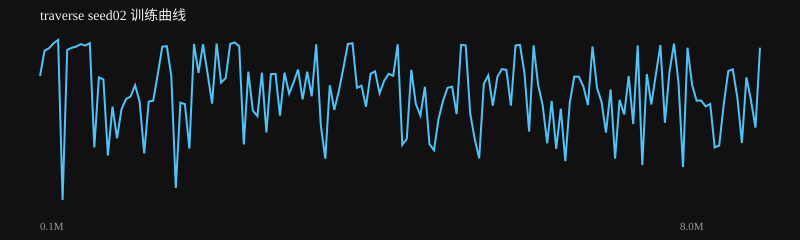
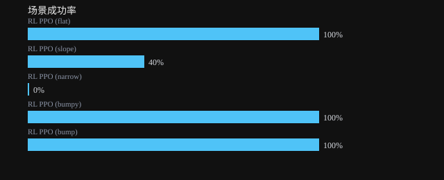

# traverse seed02 训练报告

生成时间：2026-08-17 09:45:08

**结论：❌ 未通过**

## 验收检查

- ❌ 整体成功率: 68% ≥ 80%
- ✅ 场景成功率 RL PPO (flat): 100% ≥ 60%
- ❌ 场景成功率 RL PPO (slope): 40% ≥ 60%
- ❌ 场景成功率 RL PPO (narrow): 0% ≥ 60%
- ✅ 场景成功率 RL PPO (bumpy): 100% ≥ 60%
- ✅ 场景成功率 RL PPO (bump): 100% ≥ 60%

## 指标

| 指标 | 值 |
|---|---|
| label | RL PPO (flat) / RL PPO (slope) / RL PPO (narrow) / RL PPO (bumpy) / RL PPO (bump) |
| task | traverse / traverse / traverse / traverse / traverse |
| max_dev | 0.08828348804634882 / 0.40831064334254996 / 0.02775416377719184 / 0.1152514320552957 / 0.06529606637292765 |
| min_clear |  /  /  /  /  |
| dual_hold | 0.0 / 0.0 / 0.0 / 0.0 / 0.0 |
| recovered | False / False / False / False / False |
| settle_seconds |  /  /  /  /  |
| success | True / False / False / True / True |
| success_rate | 1.0 / 0.4 / 0.0 / 1.0 / 1.0 |
| distance | 4.52222467656895 / 2.419105074231606 / 0.5612156713052985 / 4.518432699538866 / 4.512015648906458 |
| time_to_goal | 4.739999999999691 / 4.630999999999712 /  / 5.207999999999702 / 4.979999999999693 |
| falls | 0.0 / 0.6 / 1.0 / 0.0 / 0.0 |
| total_reward | 136.85890912726845 / 30.14936530251294 / 6.543791577251118 / 136.02437831837173 / 137.67008541942988 |
| mean_base_reward | 0.9542920016421664 / 0.7670582778109669 / 0.9805738364402657 / 0.9541650939074582 / 0.9593165070999248 |
| nan | False / False / False / False / False |

## 训练曲线

## 场景成功率

