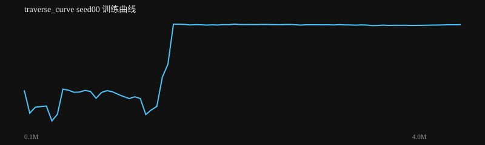

# traverse_curve seed00 训练报告

生成时间：2026-08-18 15:33:23

**结论：✅ 通过**

## 验收检查

- ✅ 整体成功率: 100% ≥ 80%
- ✅ 场景成功率 RL PPO (curve): 100% ≥ 60%

## 指标

| 指标 | 值 |
|---|---|
| label | RL PPO (curve) |
| task | traverse_curve |
| max_dev | 0.039833257254581075 |
| min_clear |  |
| dual_hold | 0.0 |
| recovered | False |
| settle_seconds |  |
| success | True |
| success_rate | 1.0 |
| distance | 1.3651505244816178 |
| time_to_goal | 5.741999999999727 |
| falls | 0.0 |
| total_reward | 132.71587543542506 |
| mean_base_reward | 0.9605863430775278 |
| nan | False |

## 训练曲线

## 场景成功率

