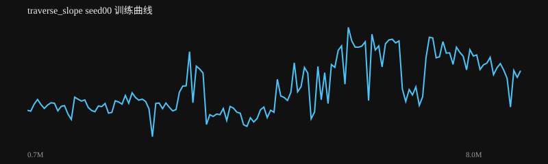
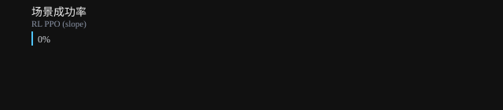

# traverse_slope seed00 训练报告

生成时间：2026-08-19 16:05:06

**结论：❌ 未通过**

## 验收检查

- ❌ 整体成功率: 0% ≥ 80%
- ❌ 场景成功率 RL PPO (slope): 0% ≥ 60%

## 指标

| 指标 | 值 |
|---|---|
| label | RL PPO (slope) |
| task | traverse_slope |
| max_dev | 0.4008353028777955 |
| min_clear |  |
| dual_hold | 0.0 |
| recovered | False |
| settle_seconds |  |
| success | False |
| success_rate | 0.0 |
| distance | 0.8679497508058912 |
| time_to_goal |  |
| falls | 1.0 |
| total_reward | -1.886371826223532 |
| mean_base_reward | 0.9581911067673474 |
| nan | False |

## 训练曲线

## 场景成功率

